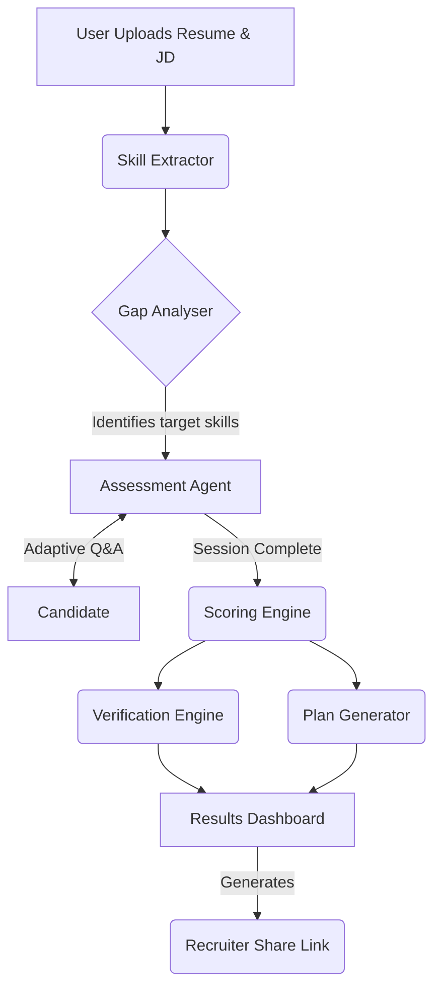

# Skill Assessment — AI-Powered Interview Platform

An AI-driven skill gap analyser that interviews candidates skill-by-skill and generates a personalised learning roadmap.

## What it does

1. **Paste a Job Description + Resume** — the AI extracts required and held skills
2. **AI Interview** — adaptive questions per skill (easy → medium → hard), powered by Gemini
3. **Scored Results** — each skill is scored 0–100 with a band label
4. **Learning Roadmap** — week-by-week plan with curated free resources

## ✨ Premium Features & Enhancements

This project goes beyond a standard CRUD application by integrating advanced AI reasoning and premium UX features:

- **🕵️ Claim vs. Reality Engine**: Automatically cross-references resume claims against actual assessment performance to detect *Inflated Claims*, *Hidden Gaps*, and *Verified Strengths*.
- **🧠 Adaptive Reasoning Trace**: Exposes the AI's internal logic during the interview (e.g., *"Candidate missed state synchronization. Escalating to a scenario-based question."*) so users can see the difficulty adapting in real-time.
- **🎯 AI-Driven Hire Recommendation**: Synthesizes the final scores against the Job Description to output a definitive role readiness percentage and an actionable HR recommendation (e.g., *"Hire with targeted upskilling"*).
- **🎙️ Hands-Free Interviewing**: Integrated Web Speech APIs provide seamless Text-to-Speech (TTS) and Speech-to-Text (STT) capabilities for a natural, conversational interview experience.
- **🔗 Recruiter Share Links**: Generates secure, unguessable URLs for friction-free sharing of candidate results with hiring managers.
- **📱 Fluid Glassmorphism UI**: A fully responsive, modern neon-gradient aesthetic featuring dynamic micro-animations and intelligent loading sequences that transform dead waiting time into a showcase of the AI's processing logic.

---

## 🏛️ Architecture & System Flow



### 🧠 Core Services

1. **`skill_extractor.py`**: Parses unstructured text from the Job Description and Resume to map out a structured JSON array of skills, including "confidence" scores based on the resume evidence.
2. **`gap_analyser.py`**: Compares the required skills against the candidate's verified claims to build the `gap_list`—the ordered queue of topics for the interview.
3. **`assessment_agent.py`**: The dynamic brain of the interview. It evaluates the previous answer, generates real-time feedback, logs its internal *Reasoning Trace*, and crafts the next question by adapting the difficulty (easy → medium → hard).
4. **`scoring_engine.py`**: Aggregates the 1-10 scores across the assessment history to calculate a definitive 0-100 Role Readiness percentage and assigns proficiency bands.
5. **`verification_engine.py`**: Cross-references the initial resume confidence with the final assessment score to flag *Inflated Claims*, *Hidden Gaps*, and *Verified Strengths*.
6. **`plan_generator.py`**: Acts as an AI hiring manager. It looks at the total performance to output a "Hire/No Hire" recommendation and a week-by-week learning roadmap with role-relevant justifications.

---

## 📊 Scoring Logic

The platform uses a deterministic scaling system on top of the AI's semantic evaluations:

- **1-3 (Beginner)**: Answer is incorrect, irrelevant, or extremely superficial.
- **4-6 (Developing)**: Partially correct; missing key concepts or relies on flawed reasoning.
- **7-8 (Proficient)**: Mostly correct with minor omissions. Demonstrates solid practical understanding.
- **9-10 (Expert)**: Comprehensive, accurate, and well-reasoned. Explains trade-offs and edge cases.

These scores are averaged per skill to generate a `0-100%` readiness score. The `verification_engine` then applies logic gates:
- *If Resume Claim > 75% AND Assessment Score < 45%* ➔ **⚠ Inflated Claim**
- *If Resume Claim < 30% AND Assessment Score > 80%* ➔ **⭐ Undervalued Strength**

---

## 💡 Sample Inputs / Outputs

**Input (Candidate Answer):**
> *"I use React to build components. I use useState for state."*

**Output (AI Agent JSON):**
```json
{
  "evaluation": {
    "score": 4,
    "feedback": "You mentioned useState, but missed how you handle side effects or global state.",
    "key_gap": "useEffect and Context API",
    "insight": "Candidate demonstrated basic hook knowledge. Escalating to side-effect management."
  },
  "next_question": "If you needed to fetch data from an API when the component first loads, how would you implement that in React?"
}
```

---

## Assessment Depths

| Mode | Questions/skill | Use case |
|---|---|---|
| ⚡ Snapshot | 1 | Quick scan |
| 🎯 Standard | 3 | Balanced (default) |
| 🔬 Deep Dive | 5 | Thorough evaluation |

---

## Tech Stack

| Layer | Technology |
|---|---|
| Backend | Django 4.2 + Django REST Framework |
| AI | Google Gemini 2.5 Flash (via `google-genai`) |
| Frontend | React 18 + Vite + React Router |
| Database | SQLite (dev) / PostgreSQL (prod) |

---

## Local Setup

### Prerequisites
- Python 3.9+
- Node.js 18+
- A free [Google AI Studio API key](https://aistudio.google.com/apikey)

### 1. Clone the repo

```bash
git clone https://github.com/mijwad7/skill-sage.git
cd skill-sage
```

### 2. Backend setup

```bash
cd backend

# Create and activate virtual environment
python -m venv venv
venv\Scripts\activate        # Windows
# source venv/bin/activate   # macOS / Linux

# Install dependencies
pip install -r requirements.txt

# Configure environment
cp .env.example .env
# Edit .env and add your GEMINI_API_KEY

# Run migrations
python manage.py migrate

# Start backend
python manage.py runserver
```

Backend runs at `http://127.0.0.1:8000`

### 3. Frontend setup

```bash
cd frontend

# Install dependencies
npm install

# Start dev server
npm run dev
```

Frontend runs at `http://localhost:5173`

---

## Project Structure

```
skill-sage/
├── backend/
│   ├── backend/          # Django settings, URLs, WSGI
│   ├── core/             # Session model, views, migrations
│   ├── services/         # AI service layer
│   │   ├── skill_extractor.py   # Extracts skills from JD + resume
│   │   ├── gap_analyser.py      # Identifies skill gaps to assess
│   │   ├── assessment_agent.py  # Adaptive interview agent
│   │   ├── scoring_engine.py    # Computes 0-100 scores
│   │   ├── plan_generator.py    # Generates learning roadmap & hire recommendation
│   │   └── verification_engine.py # Detects mismatches between claims and reality
│   ├── requirements.txt
│   └── .env.example
└── frontend/
    ├── src/
    │   ├── api/          # API client
    │   ├── components/   # Shared UI components
    │   └── pages/        # UploadPage, AssessmentPage, ResultsPage
    └── package.json
```

---

## Environment Variables

| Variable | Description |
|---|---|
| `DJANGO_SECRET_KEY` | Django secret key (generate a new one for production) |
| `DEBUG` | `True` for dev, `False` for production |
| `ALLOWED_HOSTS` | Comma-separated allowed hostnames |
| `GEMINI_API_KEY` | Google Gemini API key from [AI Studio](https://aistudio.google.com/apikey) |
| `CORS_ALLOWED_ORIGINS` | Comma-separated frontend origins |
| `DATABASE_URL` | PostgreSQL URL (optional — uses SQLite if not set) |

---

## API Endpoints

| Method | Path | Description |
|---|---|---|
| `POST` | `/api/sessions/` | Create session, extract skills, get first question |
| `GET` | `/api/sessions/<id>/` | Get session state |
| `POST` | `/api/sessions/<id>/message/` | Send answer, receive next question |
| `GET` | `/api/sessions/<id>/results/` | Get final scores + learning plan |
